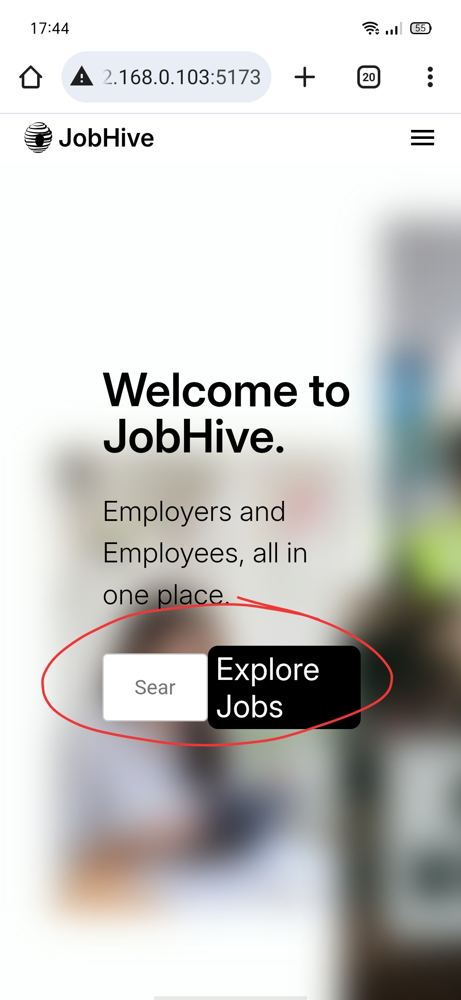

# 




# 🐝 JobHive – Job Listings SPA

## 📌 Overview

**JobHive** is a responsive Single Page Application (SPA) designed to help users browse, filter, and explore job opportunities with ease. It includes:

- 🗂️ Categorized job listings  
- 🔍 Search, filter, and sort options  
- 📄 Detailed job views  
- 📝 Visual-only application form  
- ⭐ Save jobs (UI only)  
- 💬 Feedback and contact sections  

---

## ⚙️ Key Features

### 🧭 Job Catalog
- Categories: IT & Software, Marketing, Finance, Healthcare, Government  
- Job cards show title, company, location, salary, experience level  
- “Apply Now” button (UI only)

### 🔍 Search & Filter
- Search by keyword, company, or job ID  
- Sort by date, salary, relevance  
- Filter by category, experience, type, location, remote/onsite

### 📄 Job Detail Page
- Full job description, company info, qualifications, perks  
- Static application form with confirmation modal

### 💾 Save Jobs (UI Only)
- Bookmark jobs and view them in a “Saved Jobs” section

### 💬 Feedback & Contact
- Rate the site (1–5 stars UI) and submit feedback  
- Static contact info and optional embedded map

---

## 🚀 Getting Started

### 📦 Prerequisites
- Node.js (v16+)
- Git
- Modern browser

### 🛠️ Setup Instructions

```bash
# Clone the repo
git clone https://github.com/efe-ct/jobhive.git
cd jobhive

# Install dependencies
npm install

# Start development server
npm run dev
